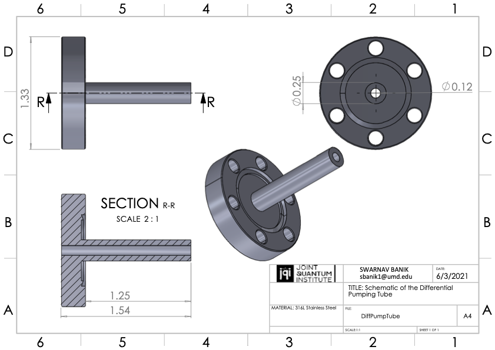

# UHV-Chamber-Designs
UHV Chamber Designs for Cold Atom Experiments.

## Need for ultra-high vacuum (UHV) for Cold Atom Experiments
The goal of an ultracold atomic physics experiment, is to produce quantum degenrate gases, for observing macroscopic effects of quantum statistics. This is possible when individual atomic wavepackets sufficiently overlap. The extent of these individual atomic wavepackets is given by the thermal de-broglie wavelength .

For a given atomic species, the only way to increase  is by reducing the temperature. After the inital pre-cooling stages, the final cooling process for quantum degenerate gas production, is evaporative cooling. Atoms are evaporatively cooled by trapping them in magnetic traps or optical dipole traps. For **effective evaporative cooling**, one requires the collisional re-thermalization time to be much shorter than the lifetime of atoms in the trap [[1]](#1). In free space, atoms collide with background air particles and are ejected from the traps. This problem is solved by maintaing a vacuum of the order of  mbar.

## ErNa Vacuum Chamber Designs
This repo contains solidwork designs of the ErNa UHV chamber. Below are images of the full assembly.

<table>
  <tr>
    <td>
      </td>
    <td></td>
  </tr>
</table>

### Overview of the different parts
All the science happens in the main chamber where sodium atoms are cooled down to a BEC. The sodium vapour is generated in the 2D MOT chamber where it is pre-cooled before being sent over to the main chamber. The pumping elements for the main chamber are attached to the 6 way cross connected to the main chamber. The main chamber and the 2D MOT are maintained at different pressures. The 2D MOT chamber has the atomic source which needs to heated to high temperatures. As a result, it is not possible to maintain UHV pressures in this chamber. So the 2D MOT chmaber and Main chamber are separated by a differential pumping tube. Below is the schematic of the differential pumping tube used.

<table>
  <tr><td align="center"></td></tr>
</table>

<table>
  <tr>
    <td align="center">
      Main Chamber
    </td>
    <td>
      2D Magneto Optical trap (2D MOT)
    </td>
    <td>
      6 Way Cross Setup
    </td align="center">
  </tr>
  <tr>
    <td>
      
    </td>
    <td>
      
    </td>
    <td>
      
    </td>
  </tr>
</table>

### Improvements from Traditional Zeeman Slowers
<table>
  <tr>
    <td align="center">
      Chamber with Zeeman Slower [2]
    </td>
    <td align="center">
      Chamber with 2D MOT
    </td>
  </tr>
  <tr>
    <td>
      
    </td>
    <td>
      
    </td>
  </tr>
</table>

The image to the left is a typical Zeeman slower [[2]](#2). Zeeman slowers are about 1m long. Our 2D MOT is atleast 3 times shorter.

## References
<a id="1">[1]</a> 
W. Keterlee, D.S. Durfee, and D.M. Stamper-Kurn (Apr. 5, 1999). 
Making, probing and understanding Bose-Einstein condensates. 
arXiv:cond-mat/9904034v2 

<a id="2">[2]</a> 
G. Edward Marti, Ryan Olf, Enrico Vogt, Anton Öttl, and Dan M. Stamper-Kurn (Apr., 2010). 
Two-element Zeeman slower for rubidium and lithium. 
Phys. Rev. A,81,043424
